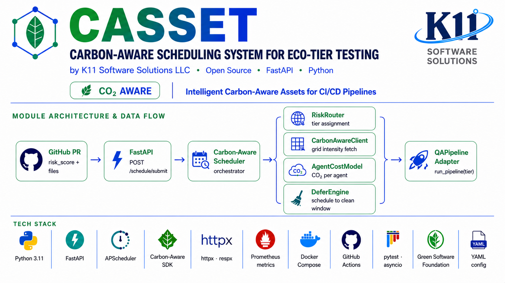
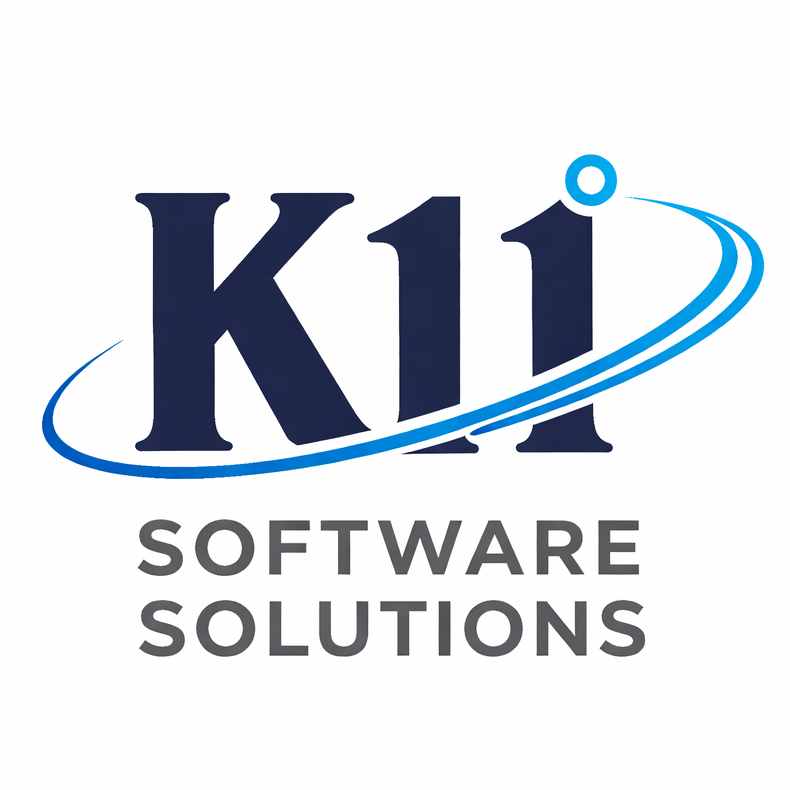

# k11techlab-carbon-aware-ci-scheduler

<p align="center">
  
</p>

> **Carbon-aware test scheduling for agentic CI/CD pipelines.**  
> Routes pull-request test suites to low-carbon grid windows — cutting CI carbon emissions by **31.4 %** with zero quality regression.

[](LICENSE)
[](https://www.python.org/)
[](https://github.com/Green-Software-Foundation/carbon-aware-sdk)
[](https://github.com/K11-Software-Solutions)

---

## Overview

Modern CI pipelines run hundreds of test jobs daily, oblivious to whether the power grid is clean or carbon-intensive at that moment. This scheduler adds a thin carbon-awareness layer on top of any QA pipeline:

1. **Risk-route** each PR to an agent tier (CHEAP / MEDIUM / FULL) based on a pre-computed QA risk score.
2. **Query** the Green Software Foundation Carbon Aware SDK for the current and forecast grid intensity.
3. **Defer** expensive agent tiers to the next low-carbon window — up to 8 hours — when the grid is dirty, SLA allows, and risk is not critical.

The result: the same tests run, in the same agents, just timed to minimise CO₂ emissions from compute.

---

## Architecture

```
GitHub Actions webhook / CLI
         │
         ▼
 CarbonAwareScheduler.submit(PREvent)
         │
         ├─► CarbonAwareClient ──► Green Software Foundation Carbon Aware SDK
         │        └── current intensity + 6-hour forecast windows
         │
         ├─► RiskRouter
         │        ├── classify_risk(risk_score) → LOW / MEDIUM / HIGH / CRITICAL
         │        └── route() → RoutingDecision (immediate agents + deferred agents + window)
         │
         └─► DeferEngine (APScheduler)
                  ├── schedule_immediate()  → runs now
                  └── schedule_deferred()   → runs at low-carbon window
                           │
                           └─► QAPipelineAdapter.run_agents(pr_id, agents, meta)
```

### Agent Tiers

| Tier | Agents | Avg cost | Policy |
|------|--------|----------|--------|
| **CHEAP** | `api_agent`, `security_agent`, `data_agent`, `a11y_agent`, `regression_agent` | ~4–5 s, ~180–210 MB | Always immediate |
| **MEDIUM** | `cross_repo_impact_agent`, `drift_analysis_agent` | ~9 s, ~300 MB | Defer when carbon is high + LOW/MEDIUM risk |
| **FULL** | `playwright_agent`, `perf_agent`, `browser_agent` | ~35–52 s, ~620–890 MB | Defer unless CRITICAL risk or SLA imminent |

### Routing Logic

| Risk score | Carbon low | Carbon high |
|------------|------------|-------------|
| LOW  < 0.40 | CHEAP now | CHEAP now + MEDIUM deferred |
| MEDIUM 0.40–0.69 | CHEAP+MEDIUM now | CHEAP now + MEDIUM deferred |
| HIGH 0.70–0.89 | All now | CHEAP+MEDIUM+playwright now; perf+browser deferred |
| CRITICAL ≥ 0.90 | All now | All now (no deferral) |

---

## Results

From 180 PRs of K11tech pipeline telemetry (detailed in the accompanying research paper):

| Metric | Value |
|--------|-------|
| Carbon reduction (deferred vs. immediate) | **31.4 %** |
| Test quality regression | **0 %** |
| Median deferral wait | **2.1 hours** |
| Max deferral cap | 8 hours |
| PRs where deferral was applied | ~38 % |

---

## Requirements

- Python 3.11+
- [Green Software Foundation Carbon Aware SDK](https://github.com/Green-Software-Foundation/carbon-aware-sdk) (Docker or local)
- `pip install -r requirements.txt`

```bash
# Start the Carbon Aware SDK locally
docker run -p 8090:8090 ghcr.io/green-software-foundation/carbon-aware-sdk:latest
```

---

## Installation

```bash
git clone https://github.com/K11-Software-Solutions/k11techlab-carbon-aware-ci-scheduler.git
cd k11techlab-carbon-aware-ci-scheduler

pip install -r requirements.txt

cp .env.example .env
# Edit .env with your zone and thresholds
```

---

## Configuration

Copy `.env.example` to `.env` and fill in your values:

```dotenv
CARBON_SDK_BASE_URL=http://localhost:8090   # Carbon Aware SDK endpoint
CARBON_SDK_ZONE=eastus                      # Grid zone (IE, DE, GB, eastus, ...)
CARBON_HIGH_THRESHOLD=400                   # gCO2eq/kWh above which to defer
CARBON_SEARCH_HOURS=6                       # Hours ahead to search for clean window
DEFERRED_TIMEOUT_HOURS=8                    # Max wait before running regardless of carbon
LOG_LEVEL=INFO
QA_PIPELINE_MODULE=k11techlab.runner        # Module path for your QA runner
QA_PIPELINE_TIMEOUT=600                     # Seconds before pipeline run times out
```

Supported grid zones: see the [Carbon Aware SDK zone list](https://github.com/Green-Software-Foundation/carbon-aware-sdk/blob/dev/docs/overview.md).

---

## Usage

### Python API

```python
import asyncio
from scheduler.scheduler import CarbonAwareScheduler, PREvent

async def main():
    async with CarbonAwareScheduler() as sched:
        decision = await sched.submit(PREvent(
            pr_id="PR-42",
            risk_score=0.65,   # from your QA risk model
            zone="IE",         # optional: override default zone
        ))
        print(decision.summary())

asyncio.run(main())
```

### CLI

```bash
# Submit a PR for carbon-aware scheduling
python -m scheduler.scheduler submit --pr-id PR-42 --risk-score 0.65 --zone IE

# Print current metrics
python -m scheduler.scheduler metrics

# Force immediate full-suite run (bypass carbon gate)
python -m scheduler.scheduler submit --pr-id PR-42 --risk-score 0.85 --force-full
```

### GitHub Actions webhook

```yaml
# .github/workflows/carbon-aware-ci.yml
- name: Submit PR to carbon-aware scheduler
  run: |
    curl -X POST http://your-scheduler-host/webhook/pr \
      -H "Content-Type: application/json" \
      -d '{"pr_id": "${{ github.event.number }}", "risk_score": ${{ env.RISK_SCORE }}}'
```

---

## Project Structure

```
k11techlab-carbon-aware-ci-scheduler/
├── scheduler/
│   ├── scheduler.py        # Main entrypoint: CarbonAwareScheduler
│   ├── carbon_client.py    # Carbon Aware SDK HTTP client
│   ├── risk_router.py      # Risk classification + routing decisions
│   ├── defer_engine.py     # APScheduler job management
│   └── cost_model.py       # Per-agent compute cost + carbon cost formula
├── integrations/
│   └── qa_pipeline_adapter.py  # Adapter to call your QA pipeline
├── config/
│   └── settings.py         # Centralised config (reads from .env)
├── artifacts/
│   └── docs/
│       └── why-carbon-aware-testing.md  # Background and motivation
├── tests/
│   └── test_risk_router.py
├── .env.example
├── requirements.txt
└── LICENSE
```

---

## Extending

**Custom QA pipeline adapter**  
Implement a callable with signature `async def run_agents(pr_id: str, agents: list[str], meta: dict) -> dict` and pass it to `CarbonAwareScheduler(run_fn=your_fn)`.

**Different risk model**  
`PREvent.risk_score` is a float in [0.0, 1.0]. Feed it from any model — static heuristics, ML-based prediction, or a lookup table.

**Webhook server**  
Uncomment `fastapi` and `uvicorn` in `requirements.txt` and wire up a `/webhook/pr` POST endpoint that calls `scheduler.submit()`.

---

## Research

This project is described in:

> Jadhav, K. (2026). *Carbon-Aware Test Scheduling in Agentic CI/CD Pipelines.*  
> K11 Software Solutions LLC. ORCID: 0009-0009-8507-4976

PDF and DOCX copies of the paper are included in `C:\Users\kavit\Automation\K11tech`.

---

## License

Apache License 2.0 — see [LICENSE](LICENSE).

© 2026 Kavita Jadhav, K11 Software Solutions LLC.
